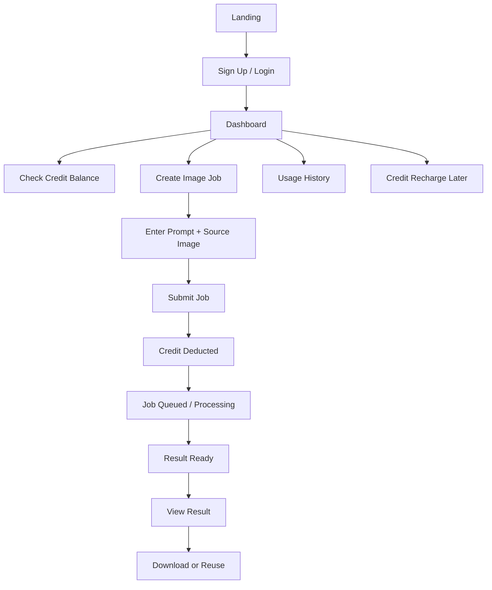

# User Mode Plan

> Historical UX planning note from an earlier direction.
> It is not the current source of truth for the implemented ImageFlow product.
> Use [product-overview.md](/abs/path/c:/Users/tsline/IdeaProjects/imageflow/docs/product-overview.md:1) for the current scope.

This document prioritizes the general user experience before any admin mode.

## Product Direction

The first usable version should answer one question:

`Can a normal user sign up, spend credits, request image processing, and view the result without admin help?`

That means the product should be designed from the user journey outward, not from an admin console inward.

## Primary User

- creator or small business owner
- uploads or references an image
- submits a prompt
- spends credits
- waits for a result
- views job history and usage

## Non-Goal For Now

- admin dashboard
- manual approval workflows
- advanced billing back office
- role-based management screens
- operator analytics

These can come after the user-facing loop is stable.

## Core User Journey

## MVP Use Cases

### UC-01 Sign Up User

- Actor: general user
- Goal: create an account and receive initial credits
- Success:
  - user account is created
  - API key or session is issued later
  - user can enter dashboard

### UC-02 View Dashboard

- Actor: general user
- Goal: understand current usable state
- Success:
  - user sees credit balance
  - user sees recent image jobs
  - user sees job statuses

### UC-03 Create Image Job

- Actor: general user
- Goal: submit a prompt and source image to generate or edit an image
- Success:
  - job is stored
  - credits are deducted
  - job status starts as queued

### UC-04 Check Job Result

- Actor: general user
- Goal: see whether the image task succeeded or failed
- Success:
  - user sees status
  - user sees result image when complete
  - user sees failure reason when failed

### UC-05 View Usage History

- Actor: general user
- Goal: understand where credits were spent
- Success:
  - user sees time-ordered usage records
  - user sees amount spent
  - user sees related job reference

### UC-06 Recharge Credits

- Actor: general user
- Goal: add credits when balance is low
- Success:
  - balance increases
  - recharge record is stored

## Feature Breakdown

### 1. Authentication

- sign up
- login
- session or token persistence
- current user lookup

### 2. User Dashboard

- profile summary
- credit balance
- recent jobs
- recent usage records

### 3. Image Job Flow

- create job form
- prompt input
- source image url or upload
- job detail page
- status polling or refresh

### 4. Usage / Billing

- usage history list
- credit deduction history
- recharge entry point

### 5. Image Result Experience

- result preview
- download button
- retry or duplicate job

## Recommended Build Order

### Phase 1: User-First MVP

1. sign up / login
2. current user API
3. dashboard summary
4. create image job
5. image job detail
6. usage history list

### Phase 2: Job Experience Upgrade

1. result polling
2. failure state UI
3. result preview and download
4. retry flow

### Phase 3: Credit Expansion

1. credit recharge UX
2. recharge history
3. plan-specific limits

### Phase 4: Admin Later

1. user search
2. job monitoring
3. manual credit adjustment
4. operations dashboard

## Frontend Screens Needed First

- landing or login page
- sign up page
- dashboard page
- create image job page or modal
- image job detail page
- usage history page

## Backend APIs Needed First

### Authentication / User

- `POST /api/users/signup`
- `POST /api/auth/login`
- `GET /api/users/me`

### Image Jobs

- `POST /api/image-jobs`
- `GET /api/image-jobs`
- `GET /api/image-jobs/{id}`

### Usage

- `GET /api/usage-records`

### Credits

- `POST /api/credits/recharge`

## Data Model Focus

Keep the current domain shape, but think in this order:

- `User`: identity + balance
- `ImageJob`: user action + status + result
- `UsageRecord`: spending history

Admin entities are not required yet.

## UX Priorities

- user should understand current balance immediately
- user should be able to submit a job in under one minute
- user should never wonder whether a job is still running
- failure reasons should be visible without opening dev tools

## Suggested Next Implementation Step

Start with these three together:

1. `GET /api/users/{id}` or `GET /api/users/me`
2. `GET /api/image-jobs` list API
3. React dashboard screen that shows user info and recent jobs

That creates the first real user mode instead of a raw API playground.
